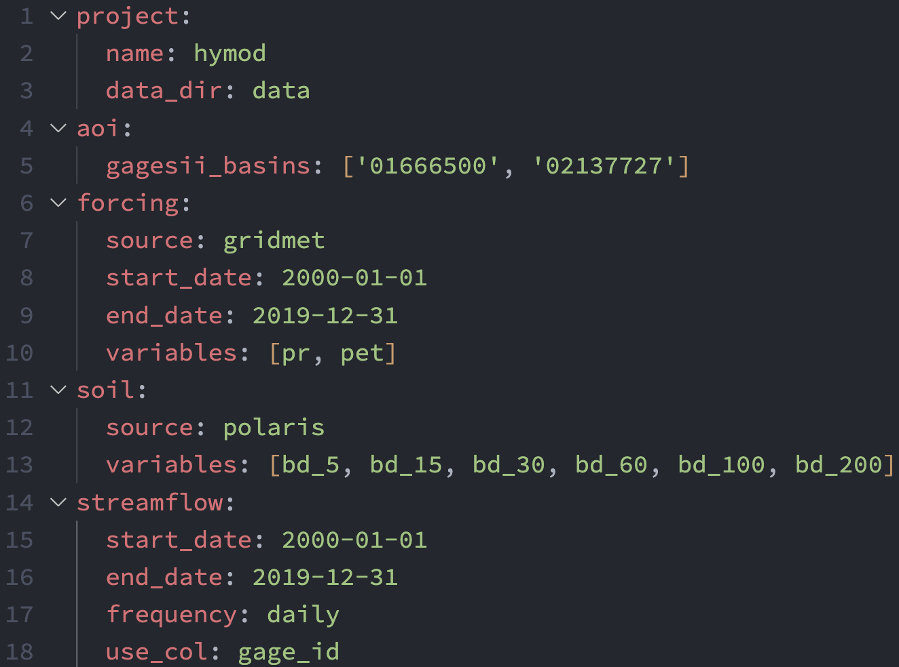
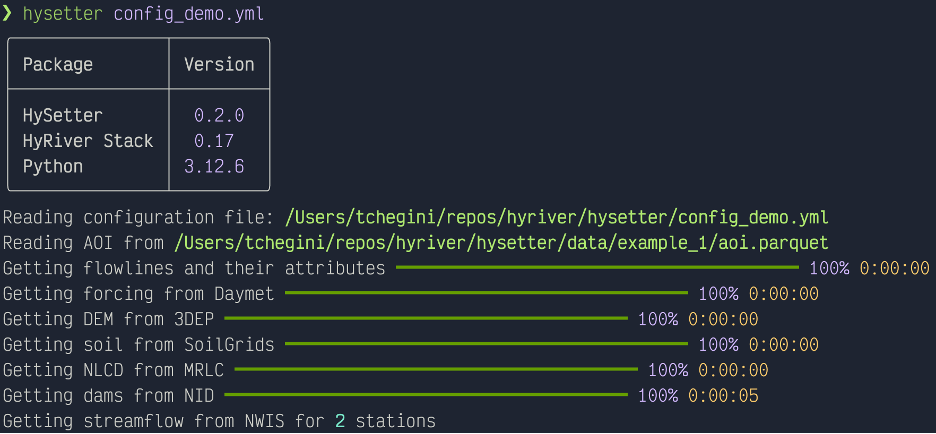
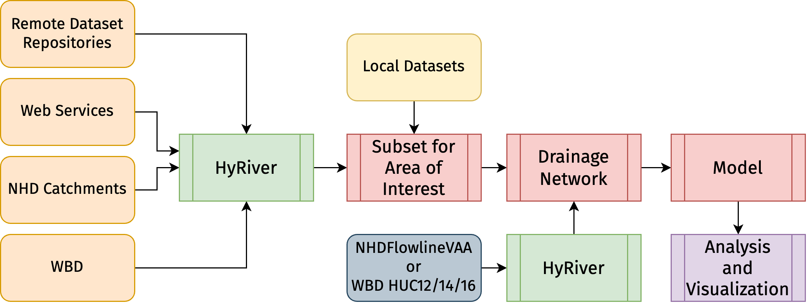

# Summary

Hydrological modeling and research increasingly requires integrating diverse
hydroclimate datasets from various sources, which creates a significant technical burden
for researchers. This data acquisition process frequently becomes a major bottleneck,
diverting valuable time and resources away from scientific analysis. HySetter addresses
this challenge by providing a command-line interface for automated and reproducible
subsetting of hydroclimate data across the conterminous United States (CONUS). Built
upon the HyRiver software stack, HySetter streamlines data acquisition through a unified
configuration file that eliminates the need for writing complex scripts for different
data sources. By centralizing the data acquisition workflow, HySetter enables
researchers to focus on scientific questions rather than data preparation, while
simultaneously enhancing the reproducibility and transparency of hydrological research.

# Statement of Need

Hydrological research increasingly demands integration of diverse datasets spanning
multiple spatial and temporal scales. However, the acquisition, processing, and
integration of these datasets presents several challenges:

1. Traditional approaches require developing complex scripts for different data sources,
    leading to fragmented workflows that hinder reproducibility.
1. Researchers often spend more time on data collection than on scientific analysis and
    interpretation.
1. The technical overhead disproportionately impacts novice researchers with limited
    programming skills, hampering their ability to conduct hydrological studies.
1. Even experienced researchers frequently develop redundant boilerplate code for data
    acquisition across different projects.

These challenges collectively undermine the adoption of FAIR (Findable, Accessible,
Interoperable, Reusable) principles [@wilkinson2016fair] in hydrological research. While
tools like HydroMT [@eilander2023hydromt] have addressed similar challenges for model
building and analysis, a comparable solution specifically targeting hydroclimate data
acquisition for CONUS remains lacking.

HySetter fills this gap by providing a user-friendly framework that requires minimal
technical expertise while supporting advanced applications. Through a simple YAML
configuration file and command-line interface, HySetter democratizes access to
hydroclimate data, enabling researchers of varying technical backgrounds to efficiently
obtain consistent, well-documented datasets for their studies.

# Functionality

HySetter employs a streamlined, configuration-based workflow that can be summarized in
four steps:

1. The user defines the area of interest (AOI) in a YAML configuration file, which can
    be based on Hydrologic Unit Codes (HUCs), GAGES-II basins, NHDPlusV2 catchments, or
    user-defined geometries.
1. The user specifies the desired datasets and their parameters (variables, temporal
    ranges, spatial resolutions) in the same configuration file.
1. HySetter processes this configuration to access and subset the relevant data through
    the HyRiver software stack.
1. The data is standardized, processed, and saved to disk in formats ready for analysis
    or modeling.

This approach accommodates users with different technical backgrounds: novice users can
manually create simple configuration files without writing code, while experienced users
can programmatically generate configurations for large-scale or complex analyses.

\\autoref{fig:config-example} shows a typical configuration file, and
\\autoref{fig:config-demo} demonstrates HySetter's command-line interface with progress
indicators during data acquisition.

{width="300pt"}

HySetter currently supports subsetting from the following data sources:

- **Area of Interest**: HUC watersheds, GAGES-II basins, NHDPlusV2 catchments and their
    attributes (StreamCat and NLDI), or user-defined geometries
- **Drainage Network**: NHDPlusV2
- **Climate Forcing**: Daymet, GridMET, NLDAS2
- **Streamflow**: National Water Information System (NWIS)
- **Soil**: gNATSGO, SoilGrids
- **Topography**: 3D Elevation Program (3DEP)
- **Dams**: National Inventory of Dams (NID)
- **Land Use/Land Cover**: Multi-Resolution Land Characteristics (MRLC) products
    including land cover, canopy, imperviousness, and urban descriptors

{width="350pt"}

# Implementation

The unified workflow of HySetter is illustrated in \\autoref{fig:flowchart}, showing how
data flows from various sources through the HyRiver stack to create subsets for specific
areas of interest. HySetter builds upon the HyRiver software stack
[@chegini2021hyriver], which provides access to numerous hydroclimate web services and
data repositories. While HyRiver offers powerful capabilities for data acquisition, it
requires Python programming knowledge that can be a barrier for some users. HySetter
adds an abstraction layer over HyRiver that translates user-friendly configuration files
into the appropriate function calls, enabling access to HyRiver's functionality without
writing complex code.

The implementation follows modular design principles with three main components:

1. **Configuration Parser**: Processes YAML configuration files to extract user
    requirements for areas of interest and data sources.
1. **Data Acquisition Engine**: Interfaces with HyRiver to retrieve and process raw data
    from multiple sources.
1. **Output Manager**: Standardizes, organizes, and exports the processed data in
    formats suitable for further analysis.

HySetter provides detailed feedback through progress bars and informative messages
during the data acquisition process, helping users track operations and diagnose
potential issues. The software includes extensive error handling to gracefully manage
common challenges in accessing remote data services, such as connection timeouts or
service disruptions.

For advanced users requiring additional post-processing capabilities, HySetter can be
used as a Python library with Pythonic and user-friendly API for accessing the
downloaded files and further post-processing geospatial operations and integration with
other Python libraries.

# Research Applications

HySetter has demonstrated its utility in diverse hydrological applications:

1. **Hydrological Modeling**: Implementation and calibration of conceptual and physical
    models across multiple watersheds, leveraging HySetter's ability to efficiently
    obtain consistent input datasets for model parameterization. The documentation
    website provides examples of using HySetter for running simulations using two
    hydrological models for select watersheds in the US.

1. **Large-Scale Studies**: Analysis of regional hydrological patterns requiring
    consistent data inputs across numerous basins, benefiting from HySetter's
    standardized approaches to data acquisition and processing.

1. **Educational Contexts**: Supporting classroom exercises where students can focus on
    understanding hydrological processes rather than struggling with technical aspects
    of data acquisition.

The standardized, reproducible nature of HySetter workflows ensures that research
outputs can be easily validated and extended by others, promoting transparency and
collaboration in hydrological sciences. By abstracting away the complexities of data
retrieval, HySetter enables researchers to allocate more time to answering critical
hydrological questions and less time to data preparation.

# Comparison with Existing Tools

Several tools have been developed to address challenges in hydrological data access and
model setup. HydroMT [@eilander2023hydromt] provides a framework for automated and
reproducible model building and analysis, focusing on transforming data into model
instances. Similarly, SWAT+AW [@chawanda2020user] offers scripted automated workflows
for the SWAT model. However, these tools primarily target model building rather than the
upstream challenge of standardized data acquisition.

HySetter differentiates itself by focusing specifically on the data acquisition stage,
offering a streamlined solution for accessing and subsetting hydroclimate data across
CONUS. Unlike more general-purpose tools, HySetter is tailored to the specific datasets
commonly used in hydrological studies over CONUS, providing optimized workflows for
these data sources. Additionally, HySetter's YAML-based configuration approach requires
minimal technical expertise, making it accessible to users with limited programming
experience.

# Conclusions and Future Work

HySetter addresses a critical gap in the hydrological modeling workflow by providing a
user-friendly, reproducible framework for hydroclimate data acquisition across CONUS. By
simplifying access to diverse data sources through a unified configuration-based
approach, HySetter enables researchers to focus on scientific questions rather than
technical challenges in data preparation.

Future development plans include:

1. Support for additional data sources based on community input and needs.
1. Development of enhanced tools for large-scale studies requiring data acquisition over
    extensive geographical areas.
1. Creation of additional documentation examples demonstrating HySetter's application in
    diverse hydrological contexts.

# Acknowledgements

This work was supported by the Consortium of Universities for the Advancement of
Hydrologic Science, Inc. (CUAHSI) through the Hydroinformatics Innovation Fellowship
program.

# References
